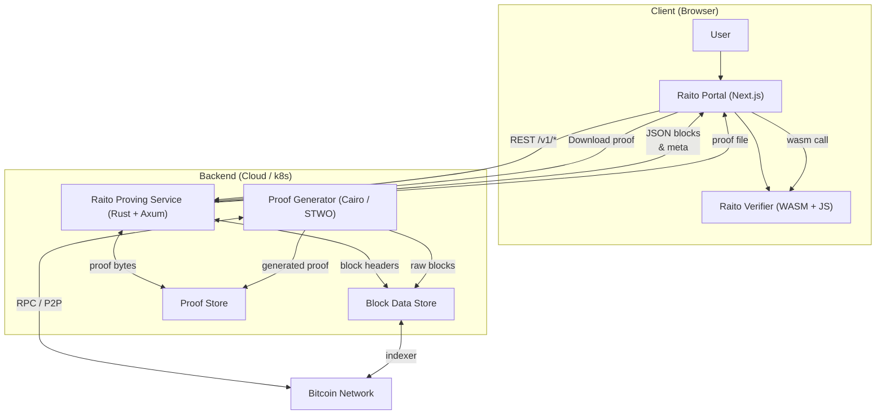
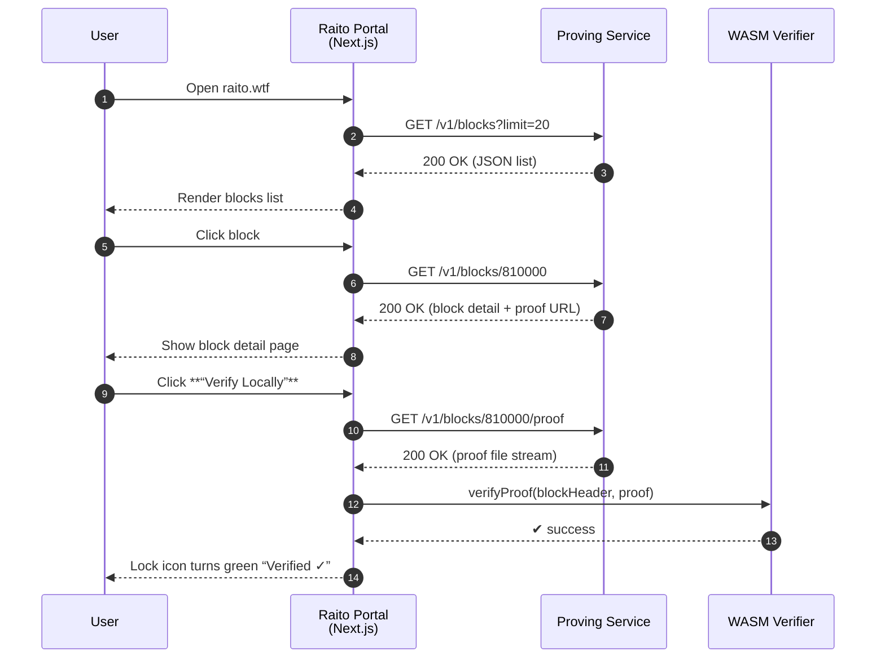

# Raito Platform – ARCHITECTURE.md

## 1 · High-Level Overview  

Raito is a **proof-based Bitcoin client** split into three logical layers:

| Layer                       | Component                 | Language                     | Purpose                                                                                                        |
| --------------------------- | ------------------------- | ---------------------------- | -------------------------------------------------------------------------------------------------------------- |
| **Presentation**            | **Raito Portal**          | React / Next.js (TypeScript) | Bitcoin-themed web app for exploring blocks, downloading proofs and running local verification in the browser. |
| **Verification**            | **Raito Verifier**        | Rust → WASM + JS wrapper     | Deterministic STARK proof verifier that can run inside browsers, NodeJS, or other Rust binaries.               |
| **Proof Generation & Data** | **Raito Proving Service** | Rust (Axum)                  | REST micro-service that stores (and later generates) proofs & block metadata and streams them to clients.      |

A fourth external “layer” is the **Bitcoin network** (or a Bitcoin Core node) that feeds raw blocks & UTXO data to the proving service in future releases.

---

## 2 · Component Glossary  

| Component                 | Key Responsibilities                                                                                                                                                          |
| ------------------------- | ----------------------------------------------------------------------------------------------------------------------------------------------------------------------------- |
| **User Browser**          | Hosts the Portal front-end; executes WASM verifier.                                                                                                                           |
| **Raito Portal**          | Fetches block data & proofs from the Proving Service, renders UI, invokes WASM verifier for “local verification”.                                                             |
| **Raito Verifier (WASM)** | Pure, deterministic verification of STARK proofs for Bitcoin block validity and transaction inclusion. Offers a thin JavaScript API (`verifyProof(blockHeader, proof)` etc.). |
| **Raito Proving Service** | • Exposes a **versioned REST API** (`/v1/…`) for blocks, proofs, and inclusion checks.                                                                                        |
 • Stores mocked data (MVP) or orchestrates Cairo/STWO proof generation (future).  
 • Streams proof files and provides OpenAPI docs. |
| **Proof Generator** | Worker module (future); executes Cairo programs & STWO to build proofs; persists to Proof Store. |
| **Block Data Store** | PostgreSQL or flat-file JSON (MVP) of block headers, txids, fees, etc. |
| **Proof Store** | Static files (MVP) → S3 or IPFS in future; holds `.json`/`.bin` proof artifacts. |
| **Bitcoin Network** | Source-of-truth blockchain data consumed by generator & store. |

---

## 3 · System Architecture Diagram  

4. End to end User Flow

