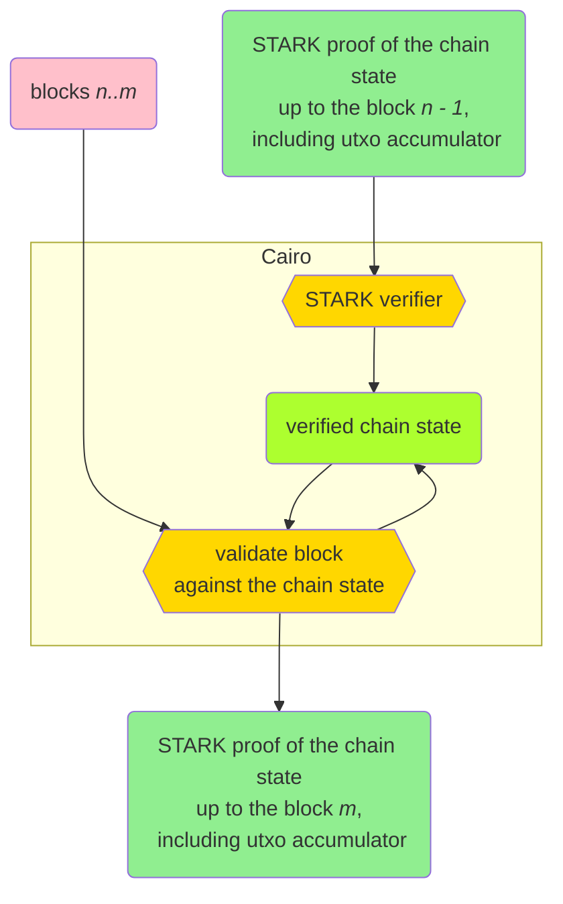

<div align="center">
    

   ***Bitcoin ZK client written in Cairo.***

<a href="https://github.com/keep-starknet-strange/raito/actions/workflows/check.yaml"></a>
<a href="https://bitcoin.org/"> </a>
<a href="https://www.cairo-lang.org/"> </a>
<a href="https://exploration.starkware.co/"></a>
</div>

## Overview

Raito is a zero-knowledge Bitcoin client implemented in Cairo. It aims to provide trustless validation of the Bitcoin blockchain through STARK proof verification. It is heavily inspired by [ZeroSync](https://github.com/ZeroSync/ZeroSynchttps://github.com/ZeroSync/ZeroSync) project.

> **Disclaimer:** This project is in the early stages of development and should not be used in production. It will evolve rapidly, expect breaking changes.



Raito, at its core, accepts two inputs: a batch of consecutive blocks <i>n</i> to <i>m</i> and a STARK proof of the state of the chain up to block <i>n−1</i>. It ensures that the historical chain state is valid by verifying the STARK proof. Then, it produces a new chain state by applying the new blocks on top of the historical state. As a result, a proof of the new state is generated.

## Applications

Although this is a highly experimental project without immediate plans for deployment, there are many potential applications:

* light clients
* IBD speedup
* non custodial bridges
* layer 2s

## Roadmap

### Milestone 1 - Block header validation

Implement a reduced light client that can verify a range of blocks starting at genesis.  
It does not have to validate execution, just check that the block header fields follow the protocol.

Tasks:

* [x] block hash computation
* [x] proof-of-work validation/computation
* [x] block time validation/computation
* [x] block difficulty adjustment
* [x] script for fetching arbitrary block data
* [x] script for preparing program arguments
* [x] script for running the program e2e for multiple blocks

### Milestone 2 - Partial transaction validation

Extend light client with partial transaction validation, but without UTXO checks.

Tasks:

* [ ] reassess validation check list (analyze Bitcoin core codebase)
* [x] generate & run integration tests e2e instead of Cairo codegen
* [x] transaction ID calculation
* [x] transaction root computation
* [x] validate transaction fee
* [x] validate coinbase transaction
* [ ] validate that transaction can be mined (locktime, sequence, coinbase maturity)
* [ ] validate segwit specific data (wtxid commitment)
* [ ] validate block weight
* [x] script that fetches blocks extended with references UTXOs
* [ ] script that runs the program e2e for a span of blocks

### Milestone 3 - Bitcoin script validation

Try to run script validation with external Cairo crate.

Tasks:

* [ ] Integrate Shinigami

### Milestone 4 - UTXO set verification

Add inclusion proofs for the UTXOs included in the block.

Tasks:

* [ ] isolate unspendable outputs (OP_RETURN, etc)
* [ ] implement cache for UTXOs spent in the same block they are created (*)
* [ ] implement transaction outpoint hashing
* [ ] implement Utreexo accumulator (addition)
* [ ] Utreexo backend that maintains utxo set and Utreexo roots
* [ ] implement Utreexo single inclusion proof verification
* [ ] implement Utreexo single output removal
* [ ] implement Utreexo bridge node that generates individual inclusion proofs
* [ ] implement script that runs the program e2e for a span of blocks

### Milestone 5 - Full consensus validation

Validate full block execution, including the Bitcoin scripts checks and Utreexo.

### Milestone 6 - Proving the validation

Recursively verify STARK proofs of chain state updates.

## Name reference

Raito is a reference to Light Yagami (夜神月, Yagami Raito) from the manga/anime Death Note.

* Raito in Japanese means "Light", which in turns can refer to Lightning ⚡ (and hence both a reference to speed of verification of the Bitcoin blockchain using a ZKP and a reference to the Lightning Network)
* Raito can work in tandem with [Shinigami](https://github.com/keep-starknet-strange/shinigami) that enables verification of Bitcoin Script programs. Raito = Consensus and Shinigami = Execution. Since Shinigami was named after Ryuk (Shinigami in Death Note), Raito was named after Light (Raito in Death Note).
* What Raito writes in the Death Note always happen, so you can see it as a source of truth, similarly to how you use a Zero-Knowledge Proof to verify the integrity of a computation.


# Contact

* [Raito Telegram](https://t.me/RaitoStarknet)
* [Raito OnlyDust](https://app.onlydust.com/p/raito---bitcoin-zk-client)

## Usage

This will compile all the components:

```bash
scarb build
```

This will run unit and integration tests:

```bash
scarb test
```

For integration tests ony:

```bash
scarb run integration_tests
```

Run for specific test file(s):

```bash
scarb run integration_tests tests/data/light_481823.json
```

Re-generate integration test data:

```base
scarb run regenerate_tests
```

* Files will be created in [tests/data/](https://github.com/keep-starknet-strange/raito/blob/main/tests/data)
* If you want to add a new test case, edit [scripts/data/regenerate_tests.sh](https://github.com/keep-starknet-strange/raito/blob/main/scripts/data/regenerate_tests.sh)

## Build dependencies

Install necessary packages required by Python scripts:

```bash
pip install -r scripts/data/requirements.txt
```

## References

* [STWO](https://github.com/starkware-libs/stwo)
* [Cairo](https://www.cairo-lang.org/)
* [Circle STARK paper](https://eprint.iacr.org/2024/278)
* [ZeroSync](https://github.com/ZeroSync/ZeroSync)
* [Shinigami](https://github.com/keep-starknet-strange/shinigami)

## Contributors ✨

Thanks goes to these wonderful people ([emoji key](https://allcontributors.org/docs/en/emoji-key)):

<!-- ALL-CONTRIBUTORS-LIST:START - Do not remove or modify this section -->
<!-- prettier-ignore-start -->
<!-- markdownlint-disable -->
<table>
  <tbody>
    <tr>
      <td align="center" valign="top" width="14.28%"><a href="https://github.com/AbdelStark"><br /><sub><b>A₿del ∞/21M 🐺 - 🐱</b></sub></a><br /><a href="https://github.com/keep-starknet-strange/raito/commits?author=AbdelStark" title="Code">💻</a></td>
      <td align="center" valign="top" width="14.28%"><a href="https://github.com/maciejka"><br /><sub><b>Maciej Kamiński @ StarkWare</b></sub></a><br /><a href="https://github.com/keep-starknet-strange/raito/commits?author=maciejka" title="Code">💻</a></td>
      <td align="center" valign="top" width="14.28%"><a href="https://github.com/b-j-roberts"><br /><sub><b>Brandon R</b></sub></a><br /><a href="https://github.com/keep-starknet-strange/raito/commits?author=b-j-roberts" title="Code">💻</a></td>
      <td align="center" valign="top" width="14.28%"><a href="https://nodeguardians.io/character/tadev-guardian"><br /><sub><b>Tristan</b></sub></a><br /><a href="https://github.com/keep-starknet-strange/raito/commits?author=TAdev0" title="Code">💻</a></td>
      <td align="center" valign="top" width="14.28%"><a href="https://github.com/Jeanmichel7"><br /><sub><b>Jean-Michel</b></sub></a><br /><a href="https://github.com/keep-starknet-strange/raito/commits?author=Jeanmichel7" title="Code">💻</a></td>
      <td align="center" valign="top" width="14.28%"><a href="https://github.com/lomasson"><br /><sub><b>lomasson</b></sub></a><br /><a href="https://github.com/keep-starknet-strange/raito/commits?author=lomasson" title="Code">💻</a></td>
      <td align="center" valign="top" width="14.28%"><a href="https://nodeguardians.io/character/m-kus"><br /><sub><b>Michael Zaikin</b></sub></a><br /><a href="https://github.com/keep-starknet-strange/raito/commits?author=m-kus" title="Code">💻</a></td>
    </tr>
    <tr>
      <td align="center" valign="top" width="14.28%"><a href="https://github.com/harsh-ps-2003"><br /><sub><b>Harsh Pratap Singh</b></sub></a><br /><a href="https://github.com/keep-starknet-strange/raito/commits?author=harsh-ps-2003" title="Code">💻</a></td>
      <td align="center" valign="top" width="14.28%"><a href="https://github.com/Xavek"><br /><sub><b>Xavek</b></sub></a><br /><a href="https://github.com/keep-starknet-strange/raito/commits?author=Xavek" title="Code">💻</a></td>
      <td align="center" valign="top" width="14.28%"><a href="https://www.heyfemi.com/home"><br /><sub><b>Olufemi Olumaiyegun</b></sub></a><br /><a href="https://github.com/keep-starknet-strange/raito/commits?author=olufemi-olumaiyegun" title="Code">💻</a></td>
      <td align="center" valign="top" width="14.28%"><a href="https://github.com/MSghais"><br /><sub><b>MSG</b></sub></a><br /><a href="https://github.com/keep-starknet-strange/raito/commits?author=MSghais" title="Code">💻</a></td>
      <td align="center" valign="top" width="14.28%"><a href="http://mubarak23.github.io/"><br /><sub><b>Mubarak Muhammad Aminu</b></sub></a><br /><a href="https://github.com/keep-starknet-strange/raito/commits?author=mubarak23" title="Code">💻</a></td>
      <td align="center" valign="top" width="14.28%"><a href="https://github.com/oluwa-peski"><br /><sub><b>oluwapeski</b></sub></a><br /><a href="https://github.com/keep-starknet-strange/raito/commits?author=oluwa-peski" title="Code">💻</a></td>
      <td align="center" valign="top" width="14.28%"><a href="https://github.com/stevencartavia"><br /><sub><b>Steven</b></sub></a><br /><a href="https://github.com/keep-starknet-strange/raito/commits?author=stevencartavia" title="Code">💻</a></td>
    </tr>
    <tr>
      <td align="center" valign="top" width="14.28%"><a href="https://github.com/manlikeHB"><br /><sub><b>Yusuf Habib</b></sub></a><br /><a href="https://github.com/keep-starknet-strange/raito/commits?author=manlikeHB" title="Code">💻</a></td>
      <td align="center" valign="top" width="14.28%"><a href="https://github.com/Gerson2102"><br /><sub><b>Gerson</b></sub></a><br /><a href="https://github.com/keep-starknet-strange/raito/commits?author=Gerson2102" title="Code">💻</a></td>
      <td align="center" valign="top" width="14.28%"><a href="https://github.com/PavitraAgarwal21"><br /><sub><b>PavitraAgarwal21</b></sub></a><br /><a href="https://github.com/keep-starknet-strange/raito/commits?author=PavitraAgarwal21" title="Code">💻</a></td>
      <td align="center" valign="top" width="14.28%"><a href="https://github.com/bloomingpeach"><br /><sub><b>Nguyen Dao</b></sub></a><br /><a href="https://github.com/keep-starknet-strange/raito/commits?author=bloomingpeach" title="Code">💻</a></td>
    </tr>
  </tbody>
</table>

<!-- markdownlint-restore -->
<!-- prettier-ignore-end -->

<!-- ALL-CONTRIBUTORS-LIST:END -->

This project follows the [all-contributors](https://github.com/all-contributors/all-contributors) specification. Contributions of any kind welcome!
