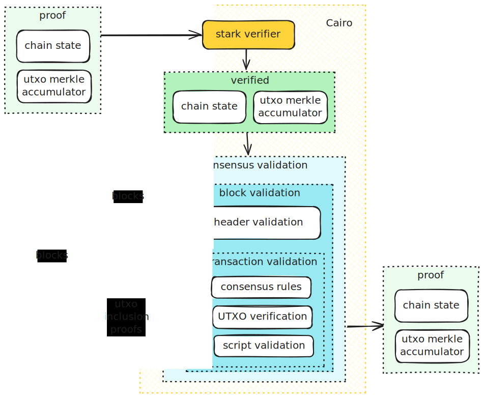

<div align="center">
    

   ***Bitcoin ZK client written in Cairo.***

<a href="https://github.com/keep-starknet-strange/raito/actions/workflows/build.yml"></a>
<a href="https://bitcoin.org/"> </a>
<a href="https://www.cairo-lang.org/"> </a>
<a href="https://exploration.starkware.co/"></a>
</div>

## Overview

Raito is a Bitcoin consensus client written in Cairo: it implements the same block validation logic as Bitcoin Core but in a provable language. What that means is after you run block validation you can present the result (e.g. chain state) and a succinct proof of execution correctness. The key is that the other party is no longer required to re-run the validation to ensure the chain state is correct, it is enough to just verify the proof.

Raito is heavily inspired by [ZeroSync](https://github.com/ZeroSync/ZeroSync) project.

> **Disclaimer:** This project is in the early stages of development and should not be used in production. It will evolve rapidly, expect breaking changes.

<p align="center" width="100%">
  
</p>

At its core, consensus client accepts two inputs: a batch of consecutive blocks <i>n</i> to <i>m</i> and a STARK proof of the state of the chain up to block <i>n−1</i>. It ensures that the historical chain state is valid by verifying the STARK proof. Then, it produces a new chain state by applying the new blocks on top of the historical state. As a result, a proof of the new state is generated.

## Applications

### Bootstrapping full nodes

Raito essentially "compresses" the block validation and hence its primary application is enabling quick node synchronization (aka initial block download — IBD). Currently if you are bootstrapping a new full node from scratch there are two options:

- Fetch all the block headers and transaction from P2P and then apply them one by one, computing the state and accumulating the UTXO set (There is an optimization [`assumevalid`](https://bitcoincore.org/en/2017/03/08/release-0.14.0/#assumed-valid-blocks) that helps to speed up the process);
- Download and import a snapshot of the chain state from some trusted source, run the usual sync in the background (see `assumeutxo`[https://bitcoinops.org/en/topics/assumeutxo/]).

First option takes a lot of time but it is trustless, while the second one is super fast but at the cost of extra trust assumption.
With STARKs we can enjoy both fast and trust-minimized synchronization!

### Witness aggregation

Non-interactive witness aggregation (also known as [transaction compression](https://delvingbitcoin.org/t/post-quantum-signatures-and-scaling-bitcoin-with-starks/1584)) is a method for more efficient block size utilization. It becomes especially important in the context of migrating to post-quantum signing schemes, which typically involve large public keys and signatures. However, even with the current set of cryptographic primitives, witness aggregation can help address the issue of payment transactions competing with complex contracts and meta-protocols.

How it works: Miners execute blocks and produce a proof of correct execution. Once this proof is available, all transaction witnesses (that include signatures, Taproot scripts, etc) can be discarded, freeing up block space for additional transactions. This approach effectively increases the "effective" block size (i.e., the maximum amount of computation) without increasing bandwidth or storage requirements. It also helps mitigate the impact of large, complex transactions (rollup state settlements, refutations, or inscriptions) that might otherwise postpone the ordinary payment transactions.

### Indexer for meta protocols

Raito can be extended with additional validation logic and custom state tree for protocols like [Runes](https://docs.ordinals.com/runes.html) and be used for bootstrapping meta indexers, similarly to how it is used for bootstrapping Bitcoin full nodes.

### Light clients

A trust-minimized bridge design requires "embedding" a Bitcoin client into the target chain for validating the block headers and verifying transaction inclusion proofs. It is typically a "light" version of the client that is efficient onchain but makes more trust assumptions.  

Raito provides building blocks for creating light clients with different tradeoffs. However the job of determining the canonical chain remains outside of Raito's scope and should be implemented separately.

### L2 solutions

Since Raito compresses block validation and execution it can be leveraged to build Bitcoin scaling solutions aka L2s: aggregate multiple transactions, execute, generate a proof, settle on Bitcoin. It is basically a validity rollup or validium if you choose to post data not on Bitcoin but elsewhere. Same would also work for meta protocols effectively turning them from [sovereign](https://celestia.org/glossary/sovereign-rollup/) to validity rollups.

Such design is much more scalable and secure compared to sidechains and free of some of the limitations of Lightning. The settlement part however remains unsolved and we yet to see proof verification happening in Bitcoin mainnet.

Some interesting read on this problem:

- <https://hackmd.io/@polyhedra/bitcoin>
- <https://l2ivresearch.substack.com/p/recent-progress-on-bitcoin-stark>

## Roadmap

<p align="center" width="100%">
  
</p>

### Milestone 1 - Block header validation

Implement a reduced light client that can verify a range of blocks starting at genesis.  
It does not have to validate execution, just check that the block header fields follow the protocol.

Tasks:

- [x] block hash computation
- [x] proof-of-work validation/computation
- [x] block time validation/computation
- [x] block difficulty adjustment
- [x] script for fetching arbitrary block data
- [x] script for preparing program arguments
- [x] script for running the program e2e for multiple blocks

### Milestone 2 - Partial transaction validation

Extend light client with partial transaction validation, but without UTXO checks.

Tasks:

- [x] reassess validation check list (analyze Bitcoin core codebase)
- [x] generate & run integration tests e2e instead of Cairo codegen
- [x] transaction ID calculation
- [x] transaction root computation
- [x] validate transaction fee
- [x] validate coinbase transaction
- [x] validate that transaction can be mined (locktime, sequence, coinbase maturity)
- [x] validate segwit specific data (wtxid commitment)
- [x] validate block weight
- [x] script that fetches blocks extended with references UTXOs
- [x] script that runs the program e2e for a span of blocks

### Milestone 3 - Bitcoin script validation

Try to run script validation with external Cairo crate.

Tasks:

- [x] Integrate Shinigami-script

### Milestone 4 - UTXO set verification

Add inclusion proofs for the UTXOs included in the block.

Tasks:

- [x] isolate unspendable outputs (OP_RETURN, etc)
- [x] implement cache for UTXOs spent in the same block they are created (*)
- [x] implement transaction outpoint hashing
- [x] implement Utreexo accumulator (addition)
- [x] Utreexo backend that maintains utxo set and Utreexo roots
- [x] implement Utreexo single inclusion proof verification
- [x] implement Utreexo single output removal
- [x] implement Utreexo bridge node that generates individual inclusion proofs
- [x] implement script that runs the program e2e for a span of blocks
- [x] implement Utreexo accumulator version compatible with [rustreexo](https://github.com/mit-dci/rustreexo)

### Milestone 5 - Full consensus validation

Validate full block execution over large number of blocks, including the Bitcoin scripts checks and Utreexo proofs.

- [x] consensus logic
- [ ] consensus logic + utreexo proofs  
- [ ] consensus logic + utreexo proofs + scripts

### Milestone 6 - Proving

Recursively verify STARK proofs of chain state updates. Still largely tbd. From initial observations it is clear that a series of optimizations will be necessary.

- [ ] sha256 optimization
- [x] don't use ByteArray when serializing data
- [ ] blocklevel recursion
- [ ] consider using garaga msm to batch signature verifications
- [ ] identify other Cairo code botlenecks

# Contact

- [Telegram](https://t.me/ShinigamiStarknet)
- [OnlyDust](https://app.onlydust.com/p/raito---bitcoin-zk-client)

## Usage

This will compile all the packages:

```bash
scarb build
```

This will run tests for all the packages:

```bash
scarb test
```

## Build dependencies

Install necessary packages required by Python scripts:

```bash
pip install -r scripts/data/requirements.txt
```

## References

- [Data processing notes](./docs/data.md)
- [Utreexo implementation notes](./docs/utreexo.md)
- [ZeroSync](https://github.com/ZeroSync/ZeroSync)
- [Bitcoin VM in Cairo](https://github.com/keep-starknet-strange/shinigami)
- [STWO](https://github.com/starkware-libs/stwo)
- [Cairo](https://www.cairo-lang.org/)
- [Circle STARK paper](https://eprint.iacr.org/2024/278)

## Contributors ✨

Thanks goes to these wonderful people ([emoji key](https://allcontributors.org/docs/en/emoji-key)):

<!-- ALL-CONTRIBUTORS-LIST:START - Do not remove or modify this section -->
<!-- prettier-ignore-start -->
<!-- markdownlint-disable -->
<table>
  <tbody>
    <tr>
      <td align="center" valign="top" width="14.28%"><a href="https://github.com/AbdelStark"><br /><sub><b>Aâ‚¿del âˆ/21M 🺠- ğŸ±</b></sub></a><br /><a href="https://github.com/keep-starknet-strange/raito/commits?author=AbdelStark" title="Code">💻</a></td>
      <td align="center" valign="top" width="14.28%"><a href="https://github.com/maciejka"><br /><sub><b>Maciej Kamiński @ StarkWare</b></sub></a><br /><a href="https://github.com/keep-starknet-strange/raito/commits?author=maciejka" title="Code">💻</a></td>
      <td align="center" valign="top" width="14.28%"><a href="https://github.com/b-j-roberts"><br /><sub><b>Brandon R</b></sub></a><br /><a href="https://github.com/keep-starknet-strange/raito/commits?author=b-j-roberts" title="Code">💻</a></td>
      <td align="center" valign="top" width="14.28%"><a href="https://nodeguardians.io/character/tadev-guardian"><br /><sub><b>Tristan</b></sub></a><br /><a href="https://github.com/keep-starknet-strange/raito/commits?author=TAdev0" title="Code">💻</a></td>
      <td align="center" valign="top" width="14.28%"><a href="https://github.com/Jeanmichel7"><br /><sub><b>Jean-Michel</b></sub></a><br /><a href="https://github.com/keep-starknet-strange/raito/commits?author=Jeanmichel7" title="Code">💻</a></td>
      <td align="center" valign="top" width="14.28%"><a href="https://github.com/lomasson"><br /><sub><b>lomasson</b></sub></a><br /><a href="https://github.com/keep-starknet-strange/raito/commits?author=lomasson" title="Code">💻</a></td>
      <td align="center" valign="top" width="14.28%"><a href="https://nodeguardians.io/character/m-kus"><br /><sub><b>Michael Zaikin</b></sub></a><br /><a href="https://github.com/keep-starknet-strange/raito/commits?author=m-kus" title="Code">💻</a></td>
    </tr>
    <tr>
      <td align="center" valign="top" width="14.28%"><a href="https://github.com/harsh-ps-2003"><br /><sub><b>Harsh Pratap Singh</b></sub></a><br /><a href="https://github.com/keep-starknet-strange/raito/commits?author=harsh-ps-2003" title="Code">💻</a></td>
      <td align="center" valign="top" width="14.28%"><a href="https://github.com/Xavek"><br /><sub><b>Xavek</b></sub></a><br /><a href="https://github.com/keep-starknet-strange/raito/commits?author=Xavek" title="Code">💻</a></td>
      <td align="center" valign="top" width="14.28%"><a href="https://www.heyfemi.com/home"><br /><sub><b>Olufemi Olumaiyegun</b></sub></a><br /><a href="https://github.com/keep-starknet-strange/raito/commits?author=olufemi-olumaiyegun" title="Code">💻</a></td>
      <td align="center" valign="top" width="14.28%"><a href="https://github.com/MSghais"><br /><sub><b>MSG</b></sub></a><br /><a href="https://github.com/keep-starknet-strange/raito/commits?author=MSghais" title="Code">💻</a></td>
      <td align="center" valign="top" width="14.28%"><a href="http://mubarak23.github.io/"><br /><sub><b>Mubarak Muhammad Aminu</b></sub></a><br /><a href="https://github.com/keep-starknet-strange/raito/commits?author=mubarak23" title="Code">💻</a></td>
      <td align="center" valign="top" width="14.28%"><a href="https://github.com/oluwa-peski"><br /><sub><b>oluwapeski</b></sub></a><br /><a href="https://github.com/keep-starknet-strange/raito/commits?author=oluwa-peski" title="Code">💻</a></td>
      <td align="center" valign="top" width="14.28%"><a href="https://github.com/stevencartavia"><br /><sub><b>Steven</b></sub></a><br /><a href="https://github.com/keep-starknet-strange/raito/commits?author=stevencartavia" title="Code">💻</a></td>
    </tr>
    <tr>
      <td align="center" valign="top" width="14.28%"><a href="https://github.com/manlikeHB"><br /><sub><b>Yusuf Habib</b></sub></a><br /><a href="https://github.com/keep-starknet-strange/raito/commits?author=manlikeHB" title="Code">💻</a></td>
      <td align="center" valign="top" width="14.28%"><a href="https://github.com/Gerson2102"><br /><sub><b>Gerson</b></sub></a><br /><a href="https://github.com/keep-starknet-strange/raito/commits?author=Gerson2102" title="Code">💻</a></td>
      <td align="center" valign="top" width="14.28%"><a href="https://github.com/PavitraAgarwal21"><br /><sub><b>PavitraAgarwal21</b></sub></a><br /><a href="https://github.com/keep-starknet-strange/raito/commits?author=PavitraAgarwal21" title="Code">💻</a></td>
      <td align="center" valign="top" width="14.28%"><a href="https://github.com/bloomingpeach"><br /><sub><b>Nguyen Dao</b></sub></a><br /><a href="https://github.com/keep-starknet-strange/raito/commits?author=bloomingpeach" title="Code">💻</a></td>
      <td align="center" valign="top" width="14.28%"><a href="https://github.com/od-hunter"><br /><sub><b>Hunter001</b></sub></a><br /><a href="https://github.com/keep-starknet-strange/raito/commits?author=od-hunter" title="Code">💻</a></td>
      <td align="center" valign="top" width="14.28%"><a href="https://github.com/feltroidprime"><br /><sub><b>feltroid Prime</b></sub></a><br /><a href="https://github.com/keep-starknet-strange/raito/commits?author=feltroidprime" title="Code">💻</a></td>
      <td align="center" valign="top" width="14.28%"><a href="https://github.com/mexes20"><br /><sub><b>Mexes</b></sub></a><br /><a href="https://github.com/keep-starknet-strange/raito/commits?author=mexes20" title="Code">💻</a></td>
    </tr>
    <tr>
      <td align="center" valign="top" width="14.28%"><a href="https://github.com/JoE11-y"><br /><sub><b>BlockyJ</b></sub></a><br /><a href="https://github.com/keep-starknet-strange/raito/commits?author=JoE11-y" title="Code">💻</a></td>
      <td align="center" valign="top" width="14.28%"><a href="https://github.com/Groxan"><br /><sub><b>Maksim Strebkov</b></sub></a><br /><a href="https://github.com/keep-starknet-strange/raito/commits?author=Groxan" title="Code">💻</a></td>
      <td align="center" valign="top" width="14.28%"><a href="https://github.com/hwildwood"><br /><sub><b>Herbie Wildwood</b></sub></a><br /><a href="https://github.com/keep-starknet-strange/raito/commits?author=hwildwood" title="Code">💻</a></td>
      <td align="center" valign="top" width="14.28%"><a href="https://github.com/fishonamos"><br /><sub><b>Fishon Amos</b></sub></a><br /><a href="https://github.com/keep-starknet-strange/raito/commits?author=fishonamos" title="Code">💻</a></td>
      <td align="center" valign="top" width="14.28%"><a href="https://github.com/raizo07"><br /><sub><b>Wolf</b></sub></a><br /><a href="https://github.com/keep-starknet-strange/raito/commits?author=raizo07" title="Code">💻</a></td>
      <td align="center" valign="top" width="14.28%"><a href="https://github.com/baitcode"><br /><sub><b>Ilia Batii</b></sub></a><br /><a href="https://github.com/keep-starknet-strange/raito/commits?author=baitcode" title="Code">💻</a></td>
      <td align="center" valign="top" width="14.28%"><a href="https://github.com/Th0rgal"><br /><sub><b>Thomas Marchand</b></sub></a><br /><a href="https://github.com/keep-starknet-strange/raito/commits?author=Th0rgal" title="Code">💻</a></td>
    </tr>
  </tbody>
</table>

<!-- markdownlint-restore -->
<!-- prettier-ignore-end -->

<!-- ALL-CONTRIBUTORS-LIST:END -->

This project follows the [all-contributors](https://github.com/all-contributors/all-contributors) specification. Contributions of any kind welcome!
