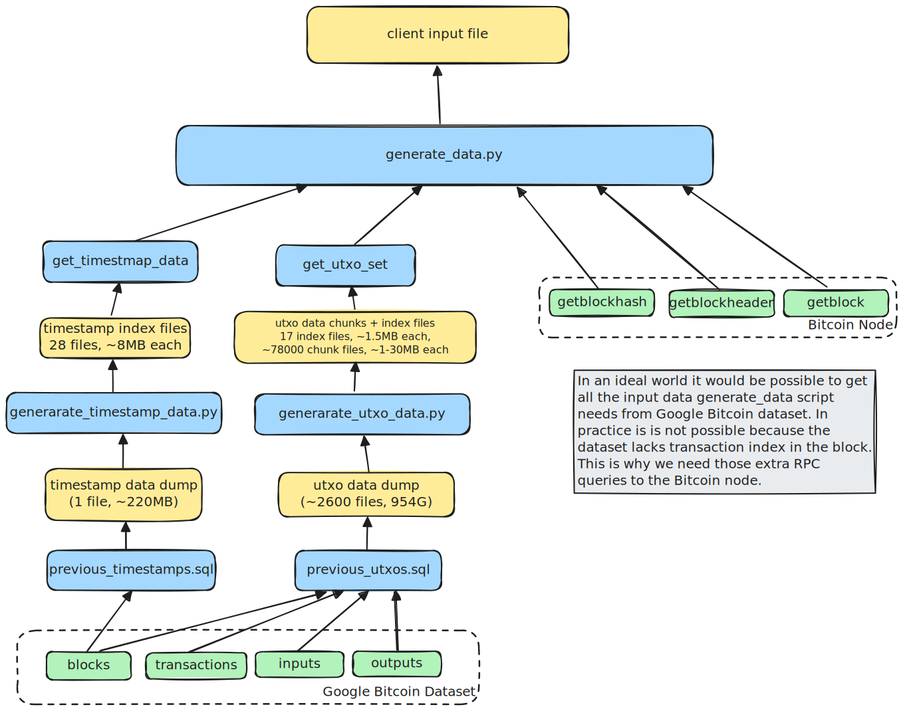

# Data processing notes
In order to generate input to the [validate_and_apply](../packages/consensus/src/types/chain_state.cairo#L62) function, a lot of data needs to be gathered. 

## ChainState and Block
Generating ChainState and Block data involves joining information between multiple blocks and transactions. Since this kind of operations is slow with Bitcoin RPC we use Google Bitcoin data set which allows us to export data with plain sql. Unfortunately due to the [missing transaction_index](https://github.com/blockchain-etl/bitcoin-etl/issues/47) bug in the data set it can't be the only source of data.

  

Input data is processed in multiple steps:
1. [previous_timestamps.sql](../scripts/data/previous_timestamps.sql) and [previous_utxos.sql](../scripts/data/previous_utxos.sql) queries dump data into GCS
2. Timestamp data dump is processed by [generate_timestamp_data.py](../scripts/data/generate_timestamp_data.py) script. Data is downloaded from GCS and index files are created. Index maps block number to per block timestamp related data. Index is broken down into smaller files, in order to be quickly loaded into the memory.
3. Utxo data dump is  by [generate_utxo_data.py](../scripts/data/generate_utxo_data.py) script: is downloaded from GCS, data files are broken down into smaller chunks, each chunk contains data about several blocks. Index files are created. Index maps block number to a chunk file. Index is broken down into smaller files.
4. After data dump processing is complete functions [`get_timestamp_data`](../scripts/data/generate_timestamp_data.py#L88) and [`get_utxo_set`](../scripts/data/generate_utxo_data.py#L125)  give access to the per block data.
5. Script [generate_data](../scripts/data/generate_data.py) generates data that can be consumed by the `validate_and_apply` function.

## UtxoSet
tbd