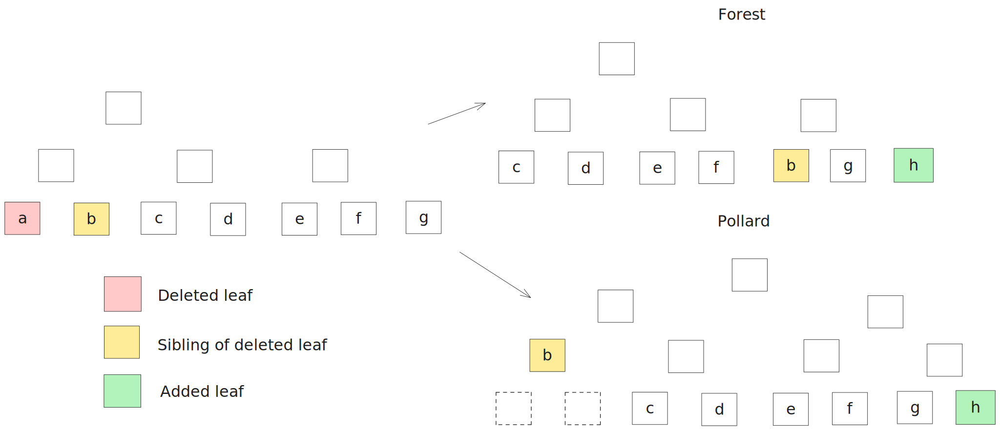
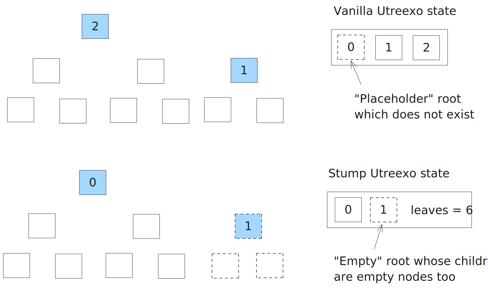
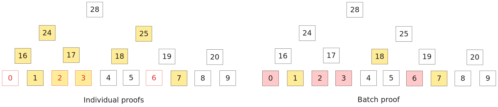

# Utreexo implementation notes

This repo contains two implementations of UTXO accumulators:
- Vanilla: implementation of the scheme described in the original [paper](https://eprint.iacr.org/2019/611.pdf)
- Stump: Cairo port of the lightweight accumulator from [rustreexo](https://github.com/mit-dci/rustreexo) crate

We started from the first one to do a PoC because it's simpler and we could also leverage the work done by [ZeroSync](https://github.com/ZeroSync/ZeroSync).  

However the accumulator scheme proposed in the paper doesn't perform well in the production setting, and the authors came up with a slightly modified design which is currently implemented in Golang and Rust and being used in [Utreexod](https://github.com/utreexo/utreexod) and [Floresta](https://github.com/vinteumorg/Floresta) Bitcoin nodes.

Check out our community call where the Utreexo accumulator is explained: https://www.youtube.com/watch?v=jq6cx6LowkA&pp=ygUYc2hpbmlnYW1pIGNvbW11bml0eSBjYWxs

> [!TIP]  
> Make sure you are familiar enough with the original Utreexo design before moving on to the next sections, as they are mostly focused on the differences between two schemes.

## Pollard

The key distinction between the original and new designs is that deleted leaves are not actually removed from the forest but made "empty" instead, moreover, their remaining siblings are "promoted" to the parent node (i.e. moving upwards). The full discussion about new accumulator design: https://github.com/mit-dci/utreexo/discussions/249

So before we had a forest of ideal binary trees where the bottom most row contains all leaves. That forest gets rebalanced every time you add or remove a leaf, so its bottom most row size is the size of the current UTXO set.
With the new design where leaves are never actually removed the forest constantly grows (to the right) while being slowly hollowed on the left, so the bottom most row size is the total number of UTXOs ever created.

  

Although the new scheme is more memory consuming it has several advantages:
- Better UTXO locality: the leaves that are spent soon are clustered at the right, so the proof size is optimal in most cases (see some [cool charts](https://github.com/mit-dci/utreexo/issues/257)); at the same time the proof size for old UTXOs is also amortized thanks to the "hollowing";
- The removal algorithm does not mess much with the tree structure and requires less updates of the intermediate nodes.

### Node positions

Another important implementation detail that will help with understanding is how nodes positions are calculated. In short, the current pollard is extended to the nearest perfect binary tree (i.e. the bottom most row length is power of two) and then we go row by row bottom up, enumerating both the existing and virtual nodes.

  

This allows more convenient navigation through the pollard and some bit tricks.

## Stump

Stump is the "light" version of Utreexo accumulator that contains the minimal necessary data required to verify inclusion proofs and add/remove leaves. It is not sufficient to generate proofs though — for that you need the full pollard, which is quite large.  
Stump is a perfect fit for a ZK client where maintaining large state is prohibitively expensive.

More specifically, stump consists of roots and the number of leaves (as we know this is the total number of UTXOs). Note that there are differences in how roots are stored and represented compared to the vanilla implementation:
- Roots are sorted top down
- There are no placeholders for rows that do not have roots
- Empty roots are legit, it just means its children (aka nieces) are empty too

  

Note that previously we had either a root or "null" for every row in the forest, but in stump we have to use a different approach to determine to which row a particular root belongs. A simple rule is if the row length is even we skip it, otherwise (odd) the root is added. Another way to see this is to look at the binary representation of the leaves number and for each "1" there should be a root in the according row.

Also it's worth noting that before "null" was indicating a missing roots whereas in stump empty root just means its children are empty too.

## Batch proof

Batch inclusion proofs were introduced in the Utreexo paper (see Appendix) and they can reduce the total size of proof(s) significantly But the batch delete algorithm was pretty complex and IO intensive. The pollard scheme streamlined batch deletions and made batch proofs more practical. Pollar batch proof contains all the intermediate nodes that cannot be computed and which are required to eventually calculate the roots (going row by row, left to right, bottom top).

  

Implementation wise there are several things you should note:
- Proof nodes are in the exact order you need them to verify proof/delete leaves
- Leaf nodes might edge in (since they are not necessarily in the bottom most row), so on every step you should pick one of {leaf, proof, computed} nodes

  

That means in a single row you can have deleted, computed, and proof nodes, so you should be able to determine which one to pick.
